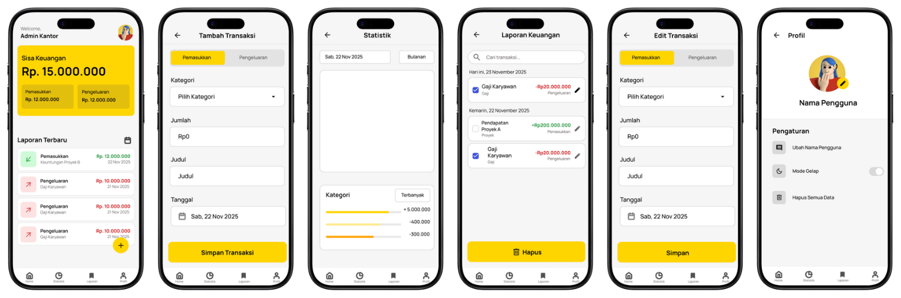
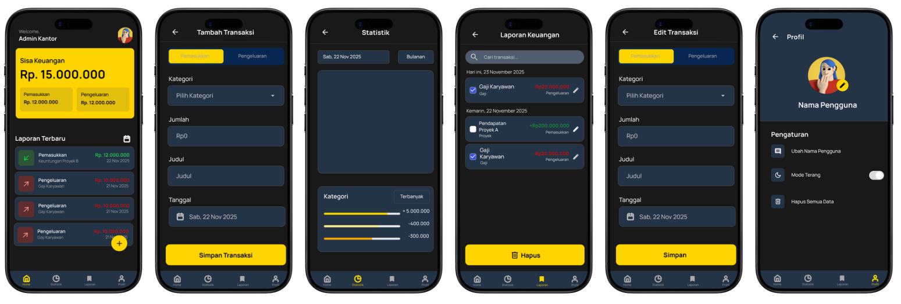

# smart-finance-mobile

*Smart Finance Mobile* merupakan aplikasi mobile berbasis Android yang
bertujuan untuk membantu pengguna dalam mengelola keuangan kas kantor
secara efektif, terstruktur, dan mudah digunakan.  
---

## Tujuan Pengembangan

Pengembangan aplikasi Smart Finance Mobile bertujuan untuk:
- Membantu pengelolaan kas kantor secara terorganisir
- Menyediakan pencatatan pemasukan dan pengeluaran yang akurat
- Mempermudah pemantauan kondisi keuangan
- Menerapkan konsep pengembangan aplikasi mobile berbasis Android

---

## Fitur Utama

- Pencatatan pemasukan
- Pencatatan pengeluaran
- Penyimpanan data keuangan secara lokal
- Dukungan *Light Mode* dan *Dark Mode*
- Antarmuka pengguna yang sederhana dan user-friendly

---

## Teknologi yang Digunakan

- *Bahasa Pemrograman*: Kotlin  
- *IDE*: Android Studio  
- *Database*: SQLite  
- *UI/UX Design*: Figma  
- *Version Control*: Git & GitHub  

---

## Desain Antarmuka (UI/UX)

Aplikasi Smart Finance Mobile mendukung *Light Mode* dan *Dark Mode*
untuk meningkatkan kenyamanan pengguna dalam berbagai kondisi pencahayaan.

*Light Mode*  

*Dark Mode*  

